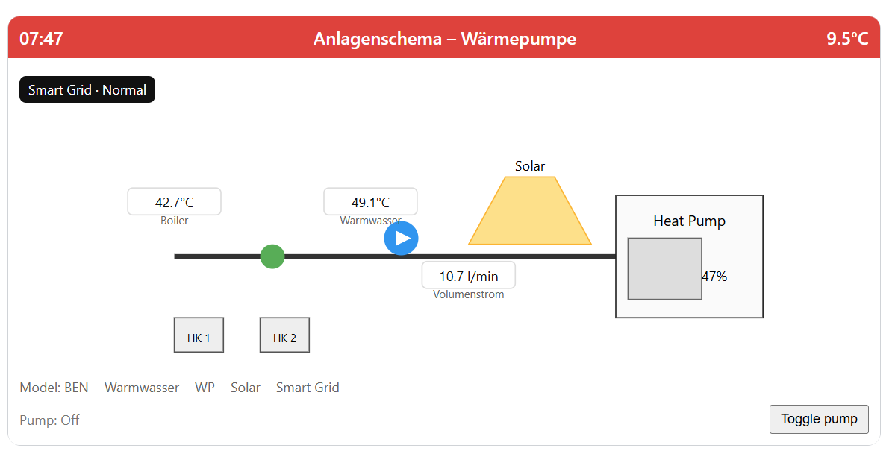

# hass_solvis_frontend – Solvis Control Card
## 0.1.1 — 2025-12-28


A Home Assistant Lovelace custom card that visualizes Solvis devices (Ben/Max, Solar/Heating/Water) with an interactive SVG UI. The card includes a GUI config editor, supports multiple device models and optional features, and comes with Playwright end‑to‑end tests.



## Installation

- HACS: Add this repository as a custom repository in HACS (Category: Plugin). Install the card.
- Manual: Copy `solvis-card.js` and the `src` folder to `/config/www/solvis-card/` (or `/www`).

Add to your Lovelace resources:

```
url: /hacsfiles/hass_solvis_frontend/solvis-card.js
type: module
```

## Usage

Add a card and search for “Solvis Control Card”, or use YAML:

```
type: custom:solvis-card
title: Solvis
model: ben            # ben | max | auto
features:
  solar: true
  heat_pump: true
  hot_water: true
  smart_grid: false
  circuits: 2         # number of heating circuits
entities:
  outdoor_temperature: sensor.outdoor_temp
  hot_water_temperature: sensor.hot_water_temp
  flow_rate: sensor.flow_rate
  pump_speed: sensor.pump_speed
  boiler_temperature: sensor.boiler_temp
```

You can also configure everything from the built‑in GUI editor.

## Development

This repository uses plain ES modules (no build step) and Playwright for e2e tests.

Run tests locally:

```
npm install
npx playwright install
npm run test:e2e
```

Open the demo page for local debugging:

```
npx serve . -p 5500
# Then open http://localhost:5500/tests/demo/index.html
```

## Releases

This repository uses release-please to automate versioning and changelog generation.

- Tag format: `vMAJOR.MINOR.PATCH` (e.g., `v0.1.1`).
- Changelog header format: `## 1.2.3 — YYYY-MM-DD`.
- During the release PR, a script updates a short version header in files that are part of the release (source files, tests, README, demo HTML). JSON files are not modified with headers to keep them valid; their `version` fields are bumped by release-please.

How to cut a release:

1. Merge conventional commits into `main`.
2. The "Release Please" workflow will open/refresh a release PR.
3. When that PR is merged, a new GitHub Release and tag (e.g., `v0.1.1`) are created automatically.

## Roadmap

- Auto‑detect features by reading entities/device info from the backend integration.
- More detailed schemas for each Solvis model.
- Service calls for toggling actuators when entities are provided.
